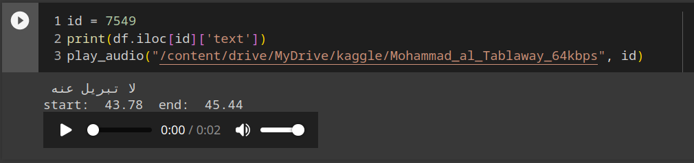

# Experiment 2B: Segment the Holy Quran using `Whisper (large)`
## Objectives
* Testing the finest model of Whisper which is Whisper-v3 with the Quran pages' audio to get the longest segments possible. [segments are the parts of the output from the model]
* Reproducing the results of Experiment-1 with the Quran pages' audio and keeping the timestamps of the segments.
* Creating a csv file containing the timestamps of the segments and the corresponding page number with index.
* Coding a utility to listen to the segments of the output with index easily.

# Experiment setup
* Platform: Kaggle
* Accelerator used: GPU T100
* Model was run on all ayat of the holy Quran both on the pages and ayat point of view.
* Shikhs:
    - Mohammad_al_Tablaway_128kbps (pages, ayat)
    - Abdul_Basit_Murattal_192kbps (ayat)
    - Hudhaify_64kbps (ayat)
# Methodology
Using the notebook below, the following is done:
* Whisper-v3 produced the output and saved it to a JSON file with pages and ayat separately.
* The JSON was converted to a CSV file stripping the irrelevant data like the confidence and the seek time.
* The CSV file was used to create a utility to listen to the segments of the output with index easily, meaning that the user can listen to the segments of the output by entering the index of the segment which makes it easy to debug the output of the model easily.

> 💡 We tried using distil-whisper [[1]] to accelerate the segmentation but it's doesn't support arabic yet.

# The notebook [[1]]
```python
path = "/kaggle/input/quran-reciters/audio/audio/Hudhaify_64kbps"
aya_names = os.listdir(path)
aya_names.sort()
aya_output = {}
for i in trange(len(aya_names)):
    aya_output[aya_names[i][:6]] = model.transcribe(audio=path+"/"+aya_names[i], language="ar")
```
# The JSON output
```json
{
  "001000": {
    "text": " أعوذ بالله من الشيطان الرجيم رجيم",
    "segments": [
      {
        "id": 0,
        "seek": 0,
        "start": 0,
        "end": 3.8000000000000003,
        "text": " أعوذ بالله من الشيطان الرجيم",
        "tokens": [
          50365,
          5551,
          3615,
          2407,
          8848,
          20666,
          43761,
          9154,
          25124,
          1829,
          9566,
          7649,
          34892,
          7435,
          32640,
          50555
        ],
        "temperature": 0,
        "avg_logprob": -0.19915316321633078,
        "compression_ratio": 1.1090909090909091,
        "no_speech_prob": 0.0022300679702311754
      },
      {
        "id": 1,
        "seek": 0,
        "start": 3.8000000000000003,
        "end": 4.5200000000000005,
        "text": " رجيم",
        "tokens": [
          50555,
          12602,
          7435,
          32640,
          50591
        ],
        "temperature": 0,
        "avg_logprob": -0.19915316321633078,
        "compression_ratio": 1.1090909090909091,
        "no_speech_prob": 0.0022300679702311754
      }
    ],
    "language": "ar"
  },
  "001001": {
    "text": " بسم الله الرحمن الرحيم",
    "segments": [
      {
        "id": 0,
        "seek": 0,
        "start": 0,
        "end": 3.8200000000000003,
        "text": " بسم الله الرحمن الرحيم",
        "tokens": [
          50365,
          4724,
          38251,
          21984,
          34892,
          5016,
          27842,
          34892,
          5016,
          32640,
          50556
        ],
        "temperature": 0,
        "avg_logprob": -0.13663370410601297,
        "compression_ratio": 1.0789473684210527,
        "no_speech_prob": 0.10650790482759476
      }
    ],
    "language": "ar"
  },
  "001002": {
    "text": " الحمد لله رب العالمين",
    "segments": [
      {
        "id": 0,
        "seek": 0,
        "start": 0,
        "end": 4.6000000000000005,
        "text": " الحمد لله رب العالمين",
        "tokens": [
          50365,
          21542,
          2304,
          3215,
          24976,
          3224,
          12602,
          3555,
          18863,
          45340,
          9957,
          50595
        ],
        "temperature": 0,
        "avg_logprob": -0.15467011011563814,
        "compression_ratio": 0.9069767441860465,
        "no_speech_prob": 0.061644479632377625
      }
    ],
    "language": "ar"
  },
  "001003": {
    "text": " الرحمن الرحيم",
    "segments": [
      {
        "id": 0,
        "seek": 0,
        "start": 0,
        "end": 3.3000000000000003,
        "text": " الرحمن الرحيم",
        "tokens": [
          50365,
          34892,
          5016,
          27842,
          34892,
          5016,
          32640,
          50530
        ],
        "temperature": 0,
        "avg_logprob": -0.11071983973185222,
        "compression_ratio": 0.8928571428571429,
        "no_speech_prob": 0.031526677310466766
      }
    ],
    "language": "ar"
  },
  "001004": {
    "text": " مالك يوم الدين",
    "segments": [
      {
        "id": 0,
        "seek": 0,
        "start": 0,
        "end": 3.7800000000000002,
        "text": " مالك يوم الدين",
        "tokens": [
          50365,
          3714,
          6027,
          4117,
          7251,
          20498,
          32748,
          9957,
          50554
        ],
        "temperature": 0,
        "avg_logprob": -0.15584033727645874,
        "compression_ratio": 0.8387096774193549,
        "no_speech_prob": 0.021575504913926125
      }
    ],
    "language": "ar"
  },
  "001005": {
    "text": " إياك نعبد وإياك نستعين",
    "segments": [
      {
        "id": 0,
        "seek": 0,
        "start": 0,
        "end": 4.94,
        "text": " إياك نعبد وإياك نستعين",
        "tokens": [
          50365,
          11933,
          25528,
          4117,
          8717,
          3615,
          44510,
          4032,
          28814,
          25528,
          4117,
          8717,
          14851,
          3615,
          9957,
          50612
        ],
        "temperature": 0,
        "avg_logprob": -0.142549150130328,
        "compression_ratio": 0.9761904761904762,
        "no_speech_prob": 0.013651539571583271
      }
    ],
    "language": "ar"
  },
  "001006": {
    "text": " اهدنا الصراط المستقيم",
    "segments": [
      {
        "id": 0,
        "seek": 0,
        "start": 0,
        "end": 4.0600000000000005,
        "text": " اهدنا الصراط المستقيم",
        "tokens": [
          50365,
          1975,
          3224,
          3215,
          8315,
          31767,
          2288,
          41193,
          9673,
          14851,
          4587,
          32640,
          50568
        ],
        "temperature": 0,
        "avg_logprob": -0.14065777403967722,
        "compression_ratio": 0.8333333333333334,
        "no_speech_prob": 0.04953298717737198
      }
    ],
    "language": "ar"
  },
  "001007": {
    "text": " صراط الذين أنعمت عليهم غير المغضوب عليهم ولا الضالين",
    "segments": [
      {
        "id": 0,
        "seek": 0,
        "start": 0,
        "end": 13.14,
        "text": " صراط الذين أنعمت عليهم غير المغضوب عليهم ولا الضالين",
        "tokens": [
          50365,
          20328,
          2288,
          41193,
          32545,
          9957,
          14739,
          25957,
          2655,
          25894,
          16095,
          32771,
          13546,
          9673,
          17082,
          11242,
          37746,
          25894,
          16095,
          49429,
          6024,
          114,
          6027,
          9957,
          51022
        ],
        "temperature": 0,
        "avg_logprob": -0.1343384155860314,
        "compression_ratio": 1.2467532467532467,
        "no_speech_prob": 0.010118240490555763
      }
    ],
    "language": "ar"
  }
}
```

# The CSV output

|sura | aya | start | end | duration | text|
| :--- | :--- | :--- | :--- | :--- | :--- |
| 001 | 000 | 0.0 | 6.34 | 6.34 |  اعوذ بالله من الشيطان الرجيم |
| 001 | 001 | 0.0 | 6.0 | 6.0 |  بسم الله الرحمن الرحيم |
| 001 | 002 | 0.0 | 6.0 | 6.0 |  الحمد لله رب العالمين |
| 001 | 003 | 0.0 | 4.18 | 4.18 |  الرحمن الرحيم |
| 001 | 004 | 0.0 | 3.9 | 3.9 |  مالك يوم الدين |
| 001 | 005 | 0.0 | 5.5 | 5.5 |  إياك نعبد وإياك نستعين |
| 001 | 006 | 0.0 | 4.52 | 4.52 |  اهدنا الصراط المستقيم |
| 001 | 007 | 0.0 | 14.16 | 14.16 |  سراط الذين أنامت عليهم غير المغضوب عليهم ولا الضالين |


# The utility [[3]]
```python
id = 7549
print(df.iloc[id]['text'])
play_audio("/content/drive/MyDrive/kaggle/Mohammad_al_Tablaway_64kbps", id)
```


[1]:https://github.com/huggingface/distil-whisper

[2]:https://www.kaggle.com/code/abdo3id/generating-signals-abdulbasit-ghamadi-hudhaify

[3]:https://colab.research.google.com/drive/1xyDVZS1xMQyDCe_bX8OmBZacR7-7uHSu