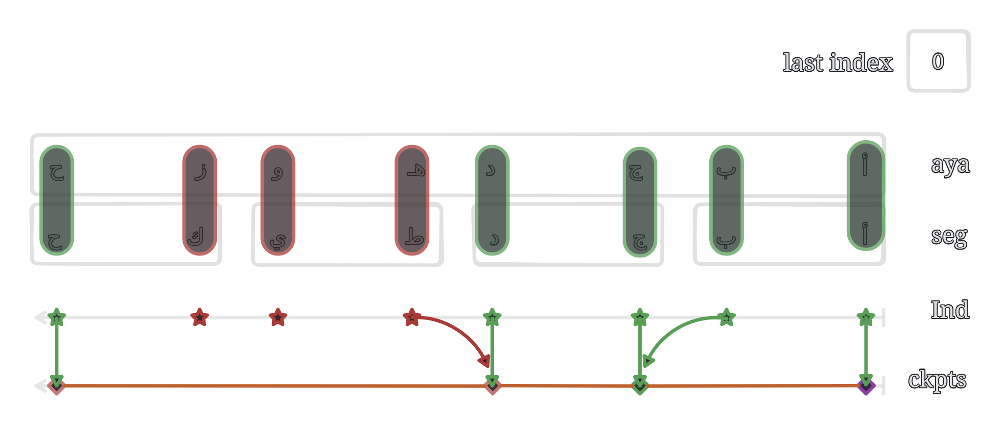

# Experiment 3: Auto annotation for segmented audio file

_Sat Dec 2 11:32:09 AM EET 2023_

Author: Abdulrhman Eid

Signed-off: Abdulrhmn Ghanem

## Objective

Prototyping an algorithm that can segment the reference text into segments that align with the audio segments generated by the model for each ayah.

---

## Methodology

### Approach

The approach is to make checkpoints on the reference text using the starting and ending words of each segment of the ayah that the model generated. Then, we will use these checkpoints to segment the reference text into segments that align with the segments generated by the model for each ayah.


---

### code [[1]]

The splitting function:

```python
def findSplitingIndices(aya_segments, ref_aya):
    checkpoints = [0]
    last_index = 0
    for segment in aya_segments:
        start_word = segment.split()[0]
        end_word   = segment.split()[-1]
        # when the segment has more than one instance of the last word
        end_word_count = segment.count(end_word)
        if end_word_count > 1:
            for i in range(end_word_count-1):
                end_index = ref_aya.find(end_word, last_index)
                last_index = end_index + len(end_word)
        start_index = ref_aya.find(start_word, last_index)
        end_index   = ref_aya.find(end_word, last_index)
        # if the end word is found
        if end_index != -1:
            last_index = end_index + len(end_word)
            checkpoints.append(end_index + len(end_word))
        # if the start word is found and the word before it was not found in the last iteration
        elif start_index != -1:
            if start_index != 0 and start_index-1 not in checkpoints:
                checkpoints.append(start_index)
    checkpoints.sort()
    return checkpoints
```

The main loop

```python
for shikh_index in range(len(shiekh_dataframes)):
    shiekh_df = shiekh_dataframes[shikh_index]
    ref_text = [""] * len(shiekh_df)
    gen_seg_num = [0] * len(shiekh_df) # number of generated segments for debugging
    ref_seg_num = [0] * len(shiekh_df) # number of reference segments for debugging
    for aya_name in aya_names[:100]: # 100 ayaat for testing
        aya_segments = getAyaSeg(aya_name, shiekh_df, reference_dataframe)['segments']
        aya_segments = segCleaning(aya_segments)
        ref_aya = getAyaSeg(aya_name, shiekh_df, reference_dataframe)['ref']
        ckpts = findSplitingIndices(aya_segments, ref_aya)
        ref_segments = getReferenceSegments(ckpts, ref_aya)

        # loop over the minimum number between the aya_segments and the ref_segments
        # if the pigeonhole principle is satisfied, then the rest of the segments will be added to the last segment
        aya_pigeonhole_indices = shiekh_df[(shiekh_df['sura '] == int(aya_name[:3])) & (shiekh_df['aya '] == int(aya_name[-3:]))].index.tolist()
        ref_seg_num[aya_pigeonhole_indices[0]] = len(ref_segments)
        gen_seg_num[aya_pigeonhole_indices[0]] = len(aya_segments)

        if len(aya_segments) < len(ref_segments):
            for i in range(len(aya_segments)):
                ref_text[aya_pigeonhole_indices[i]] = ref_segments[i]
            ref_text[aya_pigeonhole_indices[len(aya_segments)]] = ' '.join(ref_segments[len(aya_segments):])
        elif len(aya_segments) > len(ref_segments):
            for i in range(len(ref_segments)):
                ref_text[aya_pigeonhole_indices[i]] = ref_segments[i]
        else:
            for i in range(len(ref_segments)):
                ref_text[aya_pigeonhole_indices[i]] = ref_segments[i]
    print(ref_text)
    shiekh_dataframes[shikh_index]['reference_text'] = ref_text
    # add a column with the difference between the number of words in the reference text and the generated text
    shiekh_dataframes[shikh_index]['diff'] = shiekh_dataframes[shikh_index].apply(lambda row: len(row['reference_text'].split()) - len(row['text'].split()), axis=1)
    shiekh_dataframes[shikh_index]['gen_seg_num'] = gen_seg_num
    shiekh_dataframes[shikh_index]['ref_seg_num'] = ref_seg_num
```

## Results

<span style="color: #888888;">_Table 03B1_</span>
| sorah | ayah | start(s) | end(s) | duration(s) | text | reference_text | diff | gen_seg_num | ref_seg_num |
| ---- | --- | ----- | ----- | -------- | ----------------------------------------------------: | ----------------------------------------------------: | ---- | ----------- | ----------- |
| 1 | 0 | 0.0 | 3.8 | 3.8 | أعوذ بالله من الشيطان الرجيم | | -5 | 0 | 0 |
| 1 | 0 | 3.8 | 4.52 | 0.72 | رجيم | | -1 | 0 | 0 |
| 1 | 1 | 0.0 | 3.82 | 3.82 | بسم الله الرحمن الرحيم | بسم الله الرحمن الرحيم | 0 | 1 | 1 |
| 1 | 2 | 0.0 | 4.6 | 4.6 | الحمد لله رب العالمين | الحمد لله رب العالمين | 0 | 1 | 1 |
| 1 | 3 | 0.0 | 3.3 | 3.3 | الرحمن الرحيم | الرحمن الرحيم | 0 | 1 | 1 |
| 1 | 4 | 0.0 | 3.78 | 3.78 | مالك يوم الدين | مالك يوم الدين | 0 | 1 | 1 |
| 1 | 5 | 0.0 | 4.94 | 4.94 | إياك نعبد وإياك نستعين | إياك نعبد وإياك نستعين | 0 | 1 | 1 |
| 1 | 6 | 0.0 | 4.06 | 4.06 | اهدنا الصراط المستقيم | اهدنا الصراط المستقيم | 0 | 1 | 1 |
| 1 | 7 | 0.0 | 13.14 | 13.14 | صراط الذين أنعمت عليهم غير المغضوب عليهم ولا الضالين | صراط الذين أنعمت عليهم غير المغضوب عليهم ولا الضالين | 0 | 1 | 1 |
| 2 | 0 | 0.0 | 3.5 | 3.5 | بسم الله الرحمن الرحيم | | -4 | 0 | 0 |
| 2 | 1 | 0.0 | 7.0 | 7.0 | ألف لامين | الم | -1 | 1 | 1 |
| 2 | 2 | 0.0 | 3.9 | 3.9 | ذلك الكتاب لا ريب فيه | ذلك الكتاب لا ريب فيه | 0 | 2 | 2 |
| 2 | 2 | 3.9 | 7.4 | 3.5 | هدى للمتقين | هدى للمتقين | 0 | 0 | 0 |

### Data format

- sorah: the sorah number
- ayah: the ayah number
- start (s): the start time of the segment in the audio
- end (s): the end time of the segment in the audio
- duration (s): the duration of the segment in the audio
- text: the generated text
- reference_text: the reference text
- diff: the difference between the number of words in the reference text and the generated text
- gen_seg_num: the number of generated segments for each ayah, written in the first row of the ayah
- ref_seg_num: the number of reference segments (segmented by the algorithm) for each ayah, written in the first row of the ayah

---

## Notes

Regarding the output, the following points should be considered:

- The algorithm doesn't work well with the ayahs the sheikh has repeated parts of them in the audio. For example, the ayah 002061 with sheikh Abdulbasit Abdulsamad:

<span style="color: #8888;">_Table 03B2_</span>

| sorah | ayah | start(s) | end(s) | duration(s) | text                                                                                         | reference_text                                                                                                    | diff | gen_seg_num | ref_seg_num |
| ----- | ---- | ----- | ------ | -------- | --------------------------------------------------------------------------------------------: | -----------------------------------------------------------------------------------------------------------------: | ---- | ----------- | ----------- |
| 2     | 61   | 0.0   | 23.98  | 23.98    | وإذ قلتم يا موسى لن نصبر على طعام واحد فادع لنا ربك يخرج لنا مما تنبت الأرض من بقلها وقفائها | وإذ قلتم يا موسى لن نصبر على طعام واحد فادع لنا ربك يخرج لنا مما تنبت الأرض من بقلها وقثائها وفومها وعدسها وبصلها | 3    | 8           | 5           |
| 2     | 61   | 23.98 | 44.9   | 20.92    | فادع لنا ربك يخرج لنا مما تنبت الأرض من بقلها وقفائها وفومها وعدسها وبصلها                   | قال أتستبدلون الذي هو أدنى بالذي هو خير اهبطوا مصرا فإن لكم ما سألتم                                              | 0    | 0           | 0           |
| 2     | 61   | 44.9  | 53.96  | 9.06     | قال أتستبدلون الذي هو أدنى بالذي هو أدنى                                                     | وضربت عليهم الذلة والمسكنة وباءوا بغضب من الله                                                                    | 0    | 0           | 0           |
| 2     | 61   | 53.98 | 64.32  | 10.34    | إهبطوا مصرا فإن لكم ما سألتم                                                                 | ذلك بأنهم كانوا يكفرون بآيات الله ويقتلون النبيين بغير الحق                                                       | 4    | 0           | 0           |
| 2     | 61   | 64.32 | 77.88  | 13.56    | وضربت عليهم الذلة والمسكنة وباءوا بغضب من الله                                               | ذلك بما عصوا وكانوا يعتدون                                                                                        | -3   | 0           | 0           |
| 2     | 61   | 77.88 | 83.96  | 6.08     | ذلك بأنهم كانوا مصرين                                                                        |                                                                                                                   | -4   | 0           | 0           |
| 2     | 61   | 83.98 | 94.42  | 10.44    | يكفرون بآيات الله ويقتلون النبيين بغير الحق                                                  |                                                                                                                   | -7   | 0           | 0           |
| 2     | 61   | 94.42 | 101.64 | 7.22     | ذلك بما عصوا وكانوا يعتدون                                                                   |                                                                                                                   | -5   | 0           | 0           |

The sheikh said the part: "فادع لنا ربك يخرج لنا مما تنبت الأرض من بقلها وقثائها" twice. The algorithm didn't work well with this ayah. The reference text is not correct. The algorithm should be modified to handle this case.

- The algorithm doesn't handle the case when the last generated word in segment `n` and the first generated word in segment `n+1` are generated erroneously. I haven't found any example of this case in the dataset, but it should be handled.

- The algorithm needs a human to check the output and correct the mistakes in case the generated segments' number for an ayah is the same as the number of the reference segments but the number of words is not the same for each corresponding pair of segments. I found an example of this case in the dataset while testing a version of the algorithm and I handled some cases of it but I didn't handle all the cases and I don't find any occurrence of this case in the dataset now.

[1]: https://www.kaggle.com/abdo3id/aya-segments-splitter
