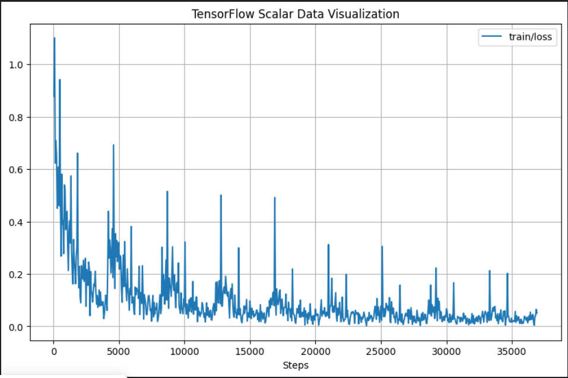
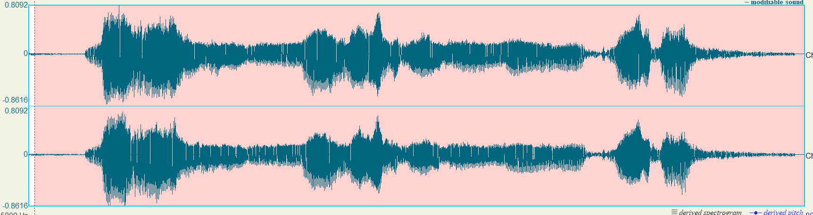
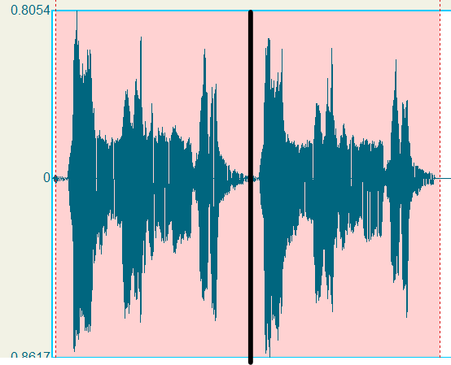

# Experiment 4: Tempo invariant model

_Sat Dec 2 11:32:09 AM EET 2023_

Author: Omar Tarek

Signed-off: Abdulrhmn Ghanem

## Objective

Finetune whisper to get better performance using audio augmentation.

---

## Experiment setup

- Accelerator used for the expirement: GPU P100

- Training was done on all ayat of the holy Quran that have a duration of 30 seconds or less.

- The sampling rate of the training is 16kHz (resampling was done on the dataset).

- Training was done on:

  - Abdul_Basit_Murattal_192kbps
  - Hudhaify_64kbps
  - Husary_128kbps
  - Mohammad_al_Tablaway_128kbps
  - Muhammad_Jibreel_64kbps
  - Ghamadi_40kbps

- Validation was done on:
  - Minshawy_Murattal_128kbps
  - Yasser_Ad-Dussary_128kbps

---

## Methodology

### Approach

- `audiomentations` [[1](https://github.com/iver56/audiomentations)] was used for audio augmentation tasks.

- Making audio augmentation on the fly while training was not efficient because each epoch is a seperate run, for this reason I made a new dataset that contains the augmented audio files.

- Those are the `TimeStretch` effect parameters used to generate the augmented dataset:

  _Table 04A1_: ranges for time stretch for each Qara', the new recitation rate is a uniform distribution between `max_rate` and `min_rate`.

  | Reciter                      | min_rate | max_rate |
  | ---------------------------- | -------- | -------- |
  | Husary_128kbps               | 0.9      | 2        |
  | Hudhaify_64kbps              | 0.7      | 1.5      |
  | Mohammad_al_Tablaway_128kbps | 0.85     | 1.85     |
  | Muhammad_Jibreel_64kbps      | 0.65     | 1.3      |
  | Abdul_Basit_Murattal_192kbps | 0.8      | 1.5      |
  | Ghamadi_40kbps               | 0.7      | 1.65     |
  | Minshawy_Murattal_128kbps    | 0.8      | 1.5      |
  | Yasser_Ad-Dussary_128kbps    | 0.7      | 1.2      |

---

### Results

> 💡 The validation is done on the whole Quran, but training was done on a subset of the Quran (ayats with duration less than 30 seconds).

_Table 04A2_: Validation results on the `validation-augmented-dataset`. The same augmentation parameters is used for both training and validation.

|                | Minshawy_Murattal_128kbps (augmented) (WER %) | Yasser_Ad-Dussary_128kbps (augmented) (WER %) | Validation Loss |
| -------------- | --------------------------------------------- | --------------------------------------------- | --------------- |
| vanilla-small  | 73.88                                         | 67.22                                         | ---             |
| vanilla-medium | 51.35                                         | 40.27                                         | ---             |
| epoch-0        | 20.77                                         | 22.01                                         | 0.0113          |
| epoch-1        | 22.93                                         | 22.25                                         | 0.0014          |
| epoch-2        | 21.14                                         | 21.87                                         | 0.0012          |
| epoch-3        | 27.93                                         | 30.16                                         | 0.0117          |
| epoch-4        | 23.90                                         | 25.58                                         | 0.0001          |
| **epoch-5**    | **19.18**                                     | **19.04**                                     | **0.0001**      |
| epoch-6        | 42.79                                         | 41.37                                         | 0.0003          |
| epoch-7        | 27.81                                         | 29.02                                         | 0.0032          |
| epoch-8        | 26.58                                         | 26.35                                         | 0.0002          |

 _Table 04A3_: Validation results but the model is finetuned using the original data (no augmentation).

| playback speed (reciter)           | vanilla-small WER % | epoch-9 WER % |
| ---------------------------------- | ------------------- | ------------- |
| normal (Minshawy_Murattal_128kbps) | 36.33%              | 14.60%        |
| normal (Yasser_Ad-Dussary_128kbps) | 25.87%              | 11.75%        |
| 1.15x (Minshawy_Murattal_128kbps)  | 62.13%              | 39.26%        |
| 1.15x (Yasser_Ad-Dussary_128kbps)  | 54.95%              | 36.76%        |
| 0.85x (Minshawy_Murattal_128kbps)  | 60.41%              | 37.00%        |
| 0.85x (Yasser_Ad-Dussary_128kbps)  | 46.74%              | 31.69%        |

**To put this in context, data augmentation cut the WER by a half.**

##

  <em>Figure 04A1: training loss for finetuning with augmented data</em>.

---

### Try it out:

- An interactive notebook with the final checkpoint: https://colab.research.google.com/drive/13unB0wLetzKkS3wBgbETdT-oz9eNa192?usp=sharing

---

### Mistakes

- whisper is trained on mono waveforms with 16kHz as a sampling rate, if the audio files contain mutliple channels you have to get a mono waveform of that audio before flattening. Skipping this step would cause the loaded waveform to have the content of channels side by side (the channels gets concatenated).

  

  

    Figure 04A2: a sample wave form with two channels.
  

  

    
  

  

    Figure 04A3: On load, the two channels gets concatenated side.
  

---

## Datasets

- augmented-dataset: https://www.kaggle.com/datasets/omartariq612/quran-reciter-augmented

- validation-augmented-dataset: https://www.kaggle.com/datasets/omartariq612/quran-validation-reciter-augmented

---

## Source code

- augmented-dataset notebook: https://www.kaggle.com/code/omartariq612/augmented-dataset

---

## References

[1] audiomentations github repo: https://github.com/iver56/audiomentations
