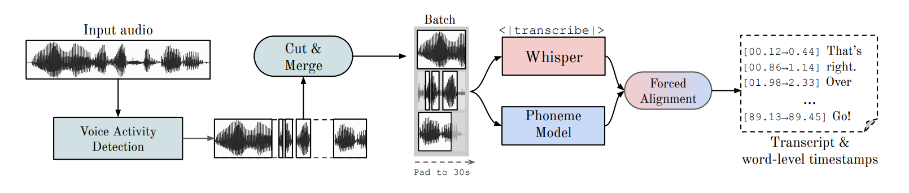

# Experiment 5: The augmentation pipeline and model hallucination

## Objective

* Make the augmented dataset look real (eliminate echo and noise).

* Understand reasons behind insertions and deletions.

---

## Methodology

### 1: Make the augmented dataset look real:

* Applying audio augmentation before downsampling (to 16000Hz) has a limited positive impact on the quality of the audio (especially for `Yasser_Ad-Dussary_128kbps`, `Ghamadi_40kbps` and `Muhammad_Jibreel_64kbps`). Listen to the results of the last 2 sections (`Input => TimeStretch (x1.5) => Output` and `Input => Resample to 16000Hz => TimeStretch (x1.5) => Output`): https://www.kaggle.com/code/omartariq612/resampling-and-augmentation?scriptVersionId=155190027#Input-=%3E-Resample-to-16000Hz-=%3E-TimeStretch-(x1.5)-=%3E-Output

* According to Data Augmentation Techniques For Robust Audio Analysis thesis [[1](https://trepo.tuni.fi/bitstream/handle/10024/117251/EklundVille-Veikko.pdf?sequence=2)]:

    > $$ y(m) = x(m) * h(m) + n(m) $$
    > where y(m) is the distorted signal, x(m) is the clean signal, h(m) is the convolutional noise or linear channel, n(m) is the additive noise, m is the discrete time index and * denotes convolution.

* Whisper is robust against additive noise to a certain level (**Section 3.7** from the whisper paper [[2](https://arxiv.org/abs/2212.04356)]:

    > ASR performance degrades as the additive noise becomes more intensive.

---

### 2: Understand reasons behind insertions and deletions:

* Strategies applied to make long-form transcription more reliable (**Section 4.5** from the whisper paper [[2](https://arxiv.org/abs/2212.04356)]):
  * > Transcribing long-form audio using Whisper relies on accurate prediction of the timestamp tokens to determine the amount to shift the model’s 30-second audio context window by, and inaccurate transcription in one window may negatively impact transcription in the subsequent windows.

  * > we use beam search with 5 beams using the log probability as the score function, to reduce repetition looping which happens more frequently in greedy decoding.

  * > We start with temperature 0, i.e. always selecting the tokens with the highest probability, and increase the temperature by 0.2 up to 1.0 when either the average log probability over the generated tokens is lower than −1 or the generated text has a gzip compression rate higher than 2.4
  
  * > Providing the transcribed text from the preceding window as previous-text conditioning when the applied temperature is below 0.5 further improves the performance

  * > We found that the probability of the <|nospeech|> token alone is not sufficient to distinguish a segment with no speech, but combining the no-speech probability threshold of 0.6 and the average log-probability threshold of −1 makes the voice activity detection of Whisper more reliable.

  * > Finally, to avoid a failure mode where the model ignores the first few words in the input, we constrained the initial timestamp token to be between 0.0 and 1.0 second

  * > **These heuristics serve as a workaround for the noisy predictions of the model, and more research would be needed to further improve the reliability of long-form decoding.**

  * **Section 6**:

  * > **Many remaining errors, particularly in long-form transcription seem more stubborn in nature and decidedly non-human/perceptual. They are a combination of failure modes of seq2seq models, language models, and text-audio alignment and include problems such as getting stuck in repeat loops, not transcribing the first or last few words of an audio segment, or complete hallucination where the model will output a transcript entirely unrelated to the actual audio**

* WhisperX [[3](https://arxiv.org/abs/2303.00747)]:

 

     <em>Figure 05A1</em>: The input audio is first segmented with Voice Activity Detection and then cut & merged into approximately 30-second input chunks with boundaries that lie on minimally active speech regions. The resulting chunks are then: (i) transcribed in parallel with Whisper, and (ii) forced aligned with a phoneme recognition model to produce accurate word-level timestamps at high throughput.
 

 

    
 

 * The achieved goal of this paper [[3](https://arxiv.org/abs/2303.00747)]: state-of-the-art performance on long-form transcription.

 * Phases are:
   * Voice Activity Detection: the benefits of using seperate VAD model instead of Whisper itself for this task are:
      > (1) VAD is much cheaper than ASR and avoids unnecessary forward passes of the latter during long inactive speech regions.

      > (2) The audio can be sliced into chunks with boundaries that do not lie on active speech regions, thereby **minimising errors due to boundary effects** and **enabling parallelised transcription**.

      > (3) the speech boundaries provided by **the VAD model can be used to constrain the word-level alignment task to more local segments and remove reliance on Whisper timestamps – which we show to be too unreliable**.

   * VAD Cut & Merge: $$ 15 secs < segment < 30 secs $$

   * Whisper Transcription in parallel with Forced Phoneme Alignment: phoneme model is used to classify the smallest unit of speech, it's language specific, we need to find one for Arabic to test this method.

---

## Conclusions

* More research need to be conducted to adjust the augmentation pipeline.

---

## Notebooks

* https://www.kaggle.com/omartariq612/resampling-and-augmentation

---

## References

[1] Data Augmentation Techniques For Robust Audio Analysis: https://trepo.tuni.fi/bitstream/handle/10024/117251/EklundVille-Veikko.pdf?sequence=2

[2] Robust Speech Recognition via Large-Scale Weak Supervision: https://arxiv.org/pdf/2212.04356.pdf

[3] WhisperX: Time-Accurate Speech Transcription of Long-Form Audio: https://arxiv.org/abs/2303.00747

[4] WhisperX github repo: https://github.com/m-bain/whisperX