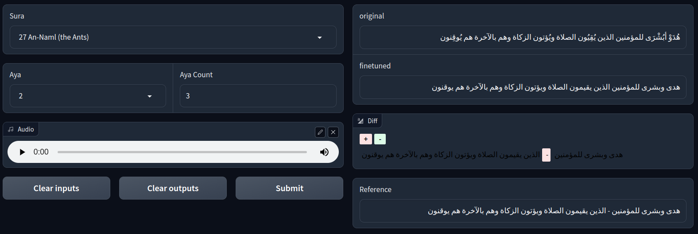
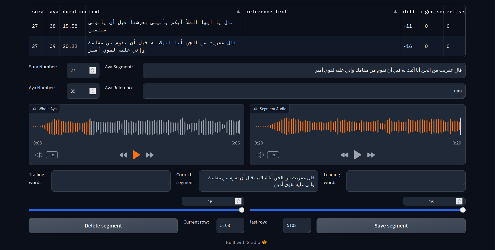

# Experiment 4: Creating a UI playground and a UI annotation app

## Objective

Creating a playground for the users to test our model. Also, creating an annotation app for volunteers to annotate the output of the model and the output of the segmentation algorithm. These apps need to be independent of the model and platform used to run the model: they run locally and on the cloud and the model can be changed easily as it is stored on HuggingFace.

---

## Experiment setup

- Accelerator used for the experiment: GPU Tesla T4
- Dataset used for the experiment: `Gen_Ref_AbdulBasit.csv`[[1]] as output to annotate and `ayah_text_clear(1).csv`[[2]] as the reference
- Python modules used: `Gradio`, `Difflib`, and `Torchaudio`

---

## APP 1: UI playground

### Objective
This app is a playground for the users to test our model using their audio files [mostly using the microphone] and for us to see the results and the difference between the original and finetuned model on the fly while developing the model.

### Picture
 

     ">
 

 

     _Figure 05B1_ : UI Playground
 

### code 
As the code is too long to be included in the report, it can be found in this [colab notebook][3] so you can run it and test it yourself.

### Bugs
- The app needs to change the color of the background of the diff element in the app for usability improvements.

---

## APP 2: UI annotation app

### Objective
This app is an annotation app for a volunteer to annotate the output of the model and the output of the segmentation algorithm: generated_part_nth and segmented_part_nth are mapped using the algorithm but the user can change the mapping if it is wrong.

### Picture
 

     ">
 

 

     _Figure 05B2_ : UI Annotation App
 

### code
As the code is too long to be included in the report, it can be found in this [colab notebook][4] so you can run it and test it yourself.

### Improvements
- The app needs to reduce the number of downloading the ayas audio files from the internet by caching the files locally.

[1]: https://www.kaggle.com/datasets/abdo3id/gen-ref-segmented-quran?select=Gen_Ref_AbdulBasit.csv
[2]: https://www.kaggle.com/datasets/abdo3id/generated-transcription-of-the-holy-quran/data?select=ayah_text_clear%281%29.csv
[3]: https://colab.research.google.com/drive/1DdNiR5J5ziVEkIShLuTu4DyYLlK52cmB
[4]: https://colab.research.google.com/drive/1h1y898zGRY8bLO5_fv0MkTt7YGmGAKCv
