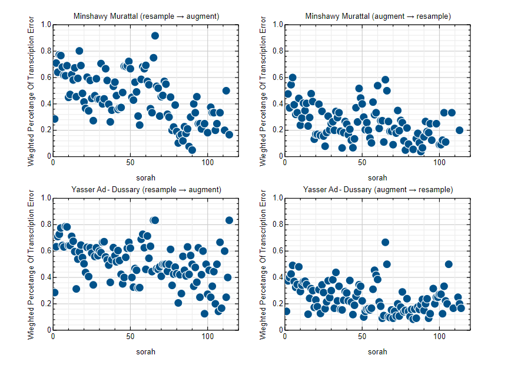
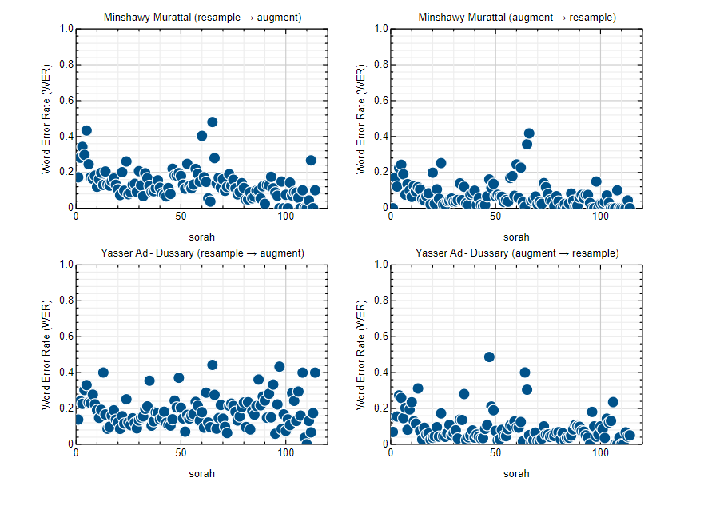
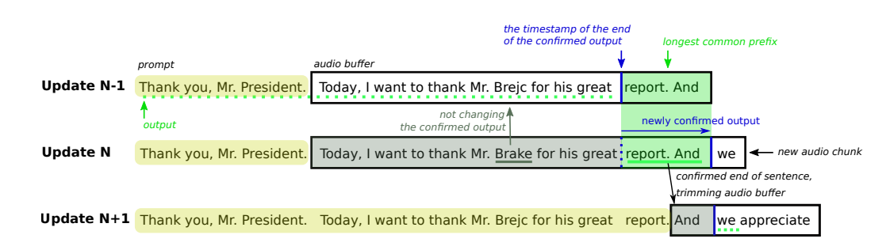

# Experiment 6: Real-time transcription

_Sat Dec 23 10:32:15 AM EET 2023_

Author: Omar Tarek

Signed-off: Abdulrhmn Ghanem

## Objective

- Studying the effect of resampling on data augmentation.

- Get the model to work in Real-time transcription mode.

---

## Methodology

### 1. Augmentation pipeline results

<span style="color: #888888;"> _Table 06B1_: (resample to 16000 Hz => TimeStretch).</span>

| model          | Minshawy_Murattal_128kbps x[0.8, 1.5] (WER %) | Yasser_Ad-Dussary_128kbps x[0.7, 1.2] (WER %) |
| -------------- | --------------------------------------------- | --------------------------------------------- |
| vanilla-small  | 73.11                                         | 63.47                                         |
| vanilla-medium | 50.38                                         | 36.94                                         |
| epoch-5        | 18.73                                         | 19.53                                         |

<span style="color: #888888;"> _Table 06B2_: (TimeStretch => resample to 16000 Hz).</span>

| model          | Minshawy_Murattal_128kbps x[0.8, 1.5] (WER %) | Yasser_Ad-Dussary_128kbps x[0.7, 1.2] (WER %) |
| -------------- | --------------------------------------------- | --------------------------------------------- |
| vanilla-small  | 51.50                                         | 49.02                                         |
| vanilla-medium | 37.62                                         | 19.81                                         |
| epoch-5        | 10.70                                         | 12.60                                         |

- It's clear that the order of resampling and augmentation affects the quality of the audio and the WER results.

 <p align="center">
     
 </p>

 <p align="center">
    <span style="color: #888888;"><em>Figure 06B2</em>: Ayah Error Rate using <a href="https://huggingface.co/omartariq612/whisper-small-augmented-epoch-5">epoch-5</a>.</span>
 </p>

 <p align="center">
     
 </p>

 <p align="center">
    <span style="color: #888888;"><em>Figure 06B2</em>: Word Error Rate using <a href="https://huggingface.co/omartariq612/whisper-small-augmented-epoch-5">epoch-5</a>.</span>
 </p>
---

### 2. Real-time transcription

- Vanilla whisper can't be used directly for real-time speech, however with some tooling it be used for **near** real-time speech recognition depending on the model size.

- [[1](https://arxiv.org/abs/2307.14743)] tries to address this drawback:

  - > Whisper is one of the recent state-of-the-art multilingual speech recognition and translation models, however, it is not designed for real time transcription. In this paper, we build on top of Whisper and create Whisper-Streaming, an implementation of real-time speech transcription and translation of Whisper-like models. Whisper-Streaming uses local agreement policy with self-adaptive latency to enable streaming transcription.

  - $$\text{A streaming policy P predicts a target segment } t_{T}\text{ at time T as: }$$
    $$t_{T} := P_{M}(c_{i} < T | s, t_{j} <T )$$
    $$\text{It operates the model M on available source chunks }c_{i} < T\text{ , previous sequence target s, and previous target segments }t_{j} < T$$

    <p align="center">
        <span style="color: #888888;"><em>Figure 06A3</em>: Illustration of processing three consecutive updates. The yellow highlighted text is a “prompt”, the previous context to follow. The black-bordered rectangle is an audio buffer, and the text inside is Whisper’s transcript generated from that sound segment. The blue vertical line is a timestamp that splits the buffer to two parts, the left being previously confirmed, and the right one is unconfirmed. The LocalAgreement-2 policy, or searching the longest common prefix, is applied on the unconfirmed (right) part in two subsequent updates. The longest common prefix is highlighted in green and the green underline highlights the newly confirmed output, whereas the green dashed underline indicates previously and subsequently confirmed output. The gray underline demonstrates an update in the confirmed part that is disregarded.</span>
    </p>
    <p align="center">
        
    </p>

  - This approach is not specific to Whisper, it can be used for any speech-to-text system that produces word-level timestamps and punctuation.

  - Example: real-time simulation from an audio file [[2](https://github.com/ufal/whisper_streaming)]:

  ```bash
  python3 whisper_online.py --lan ar \
  --task transcribe \
  --backend "faster-whisper" \
  --min-chunk-size 2 \
  --model "large-v2" \
  --vad \
  "/kaggle/input/quran-reciters/audio/audio/Abdul_Basit_Murattal_192kbps/002282.mp3" > output.txt
  ```

  <span style="color: #888888;"> _Table 06B3_: output.txt content</span>

  | Emission time from beginning of processing (ms) | Beginning timestamp of the text segment (as estimated by Whisper model) (ms) | End timestamp of the text segment (as estimated by Whisper model) (ms) | Segment                                                                                                                                                                                                                                                                                                                     |
  | ----------------------------------------------- | ---------------------------------------------------------------------------- | ---------------------------------------------------------------------- | --------------------------------------------------------------------------------------------------------------------------------------------------------------------------------------------------------------------------------------------------------------------------------------------------------------------------- |
  | 14083.0224                                      | 300                                                                          | 4320                                                                   | يَا أَيُّهَا الَّذِينَ                                                                                                                                                                                                                                                                                                      |
  | 15990.8280                                      | 4300                                                                         | 6700                                                                   | آمَنُوا إِذَا                                                                                                                                                                                                                                                                                                               |
  | 22009.4998                                      | 6700                                                                         | 13080                                                                  | تَدَايَنْتُمْ بِدَيْنٍ إِلَىٰ أَجَلٍ                                                                                                                                                                                                                                                                                        |
  | 28728.3366                                      | 13080                                                                        | 15220                                                                  | مُسَمَّنٌ                                                                                                                                                                                                                                                                                                                   |
  | 32828.4111                                      | 15200                                                                        | 21600                                                                  | فَاكْتُبُوهُ وَلْيَكْتُبْ بَيْنَكُمْ كَاتِبٌ                                                                                                                                                                                                                                                                                |
  | 37031.2803                                      | 21600                                                                        | 26720                                                                  | بِالْعَدْلِ وَلَا يَأْبَ كَاتِبٌ                                                                                                                                                                                                                                                                                            |
  | 44149.8280                                      | 26820                                                                        | 37300                                                                  | أَنْ يَكْتُبَ كَمَا عَلَّمَهُ اللَّهُ فَلْيَكْتُبْ وَلْيُمْلِلِ الَّذِي عَلَيْهِ                                                                                                                                                                                                                                            |
  | 48423.6624                                      | 37280                                                                        | 39640                                                                  | الْحَقُّ وَلْيَتَّقِ                                                                                                                                                                                                                                                                                                        |
  | 59737.3765                                      | 40320                                                                        | 44380                                                                  | رَبَّهُ وَلَا يَبْخَسْ مِنْهُ شَيْئًا                                                                                                                                                                                                                                                                                       |
  | 77439.0354                                      | 44980                                                                        | 66800                                                                  | فَإِنْ كَانَ الَّذِي عَلَيْهِ الْحَقُّ سَفِيهًا أَوْ ضَعِيفًا أَوْ لَا يَسْتَطِيعُ أَنْ يُمِلَّهُ وَفَلْيُمْلِ الْوَلِيُّهُ بِالْعَدْلِ وَاسْتَشْهِدُوا شَهِيدَيْنِ مِنْ رِجَالِكُمْ                                                                                                                                        |
  | 93774.2133                                      | 67500                                                                        | 72380                                                                  | فَإِنْ لَمْ يَكُونَا رَجُلَيْنِ                                                                                                                                                                                                                                                                                             |
  | 101178.2398                                     | 72360                                                                        | 78800                                                                  | فَرَجُلٌ وَمْرَأَتَانِ مِنْ مَنْ تَغْضَوْنَ مِنَ                                                                                                                                                                                                                                                                            |
  | 107936.3749                                     | 79440                                                                        | 95460                                                                  | الشُّهَدَاءِ أَنْ تَضِلَّ إِحْدَاهُمَا فَتُذَكِّرَ إِحْدَاهُمَا الْأُخْرَى وَلَا يَأْبَى الشُّهَدَاءُ إِذَا مَا دُعُوا                                                                                                                                                                                                      |
  | 111858.0222                                     | 96680                                                                        | 100020                                                                 | وَلَا تَسْأَمُوا                                                                                                                                                                                                                                                                                                            |
  | 116662.5535                                     | 99960                                                                        | 109980                                                                 | أَنْ تَكْتُبُوهُ صَغِيرًا أَوْ كَبِيرًا إِلَى أَجَلِهِ ذَلِكُمْ                                                                                                                                                                                                                                                             |
  | 122102.9139                                     | 109980                                                                       | 114060                                                                 | أَقْسَطُ عِنْدَ اللَّهِ وَأَقْوَمُ                                                                                                                                                                                                                                                                                          |
  | 169911.8092                                     | 114800                                                                       | 119100                                                                 | لِلشَّهَادَةِ وَأَدْنَا أَنْ لَا                                                                                                                                                                                                                                                                                            |
  | 177628.1745                                     | 119880                                                                       | 170580                                                                 | تَغْتَابُوا إِلَّا أَنْ تَكُونَ تِجَارَةً حَاضِرَةً تُدِيرُونَهَا بَيْنَكُمْ فَلَيْسَ عَلَيْكُمْ جُنَاحٌ أَنْ لَا تَكْتُبُوهَا وَأَشْهِدُوا إِذَا تَبَايَعْتُمْ وَلَا يُضَارَّ كَاتِبٌ وَلَا شَهِيدٌ وَإِن تَفْعَلُوا فَإِنَّهُ فُسُوْقٌ بِكُمْ وَاتَّقُوا اللَّهَ وَيُعَلِّمُكُمُ اللَّهُ وَاللَّهُ بِكُلِّ شَيْءٍ عَلِيمٌ |

---

## Source Code

### Notebooks

- non-zero-wer: https://www.kaggle.com/code/omartariq612/non-zero-wer

---

- transformers-whisper-quran-cli: https://github.com/OmarTariq612/transformers-whisper-quran-cli.git

---

## Datasets

- resample_before_augmentation_dataset: https://www.kaggle.com/datasets/omartarik612/resample-before-augmentation

- resample_after_augmentation_dataset: https://www.kaggle.com/datasets/omartariq612/resample-after-augmentation-dataset

---

## References

[1] Turning Whisper into Real-Time Transcription System: https://arxiv.org/abs/2307.14743

[2] whisper_streaming Github Repo: https://github.com/ufal/whisper_streaming
