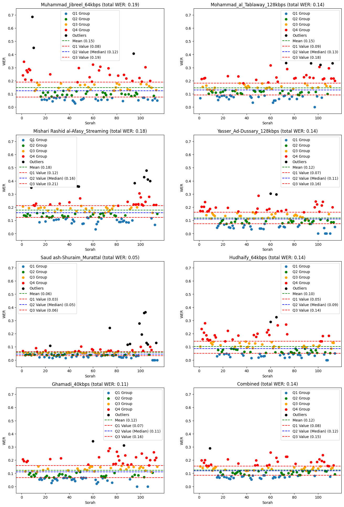
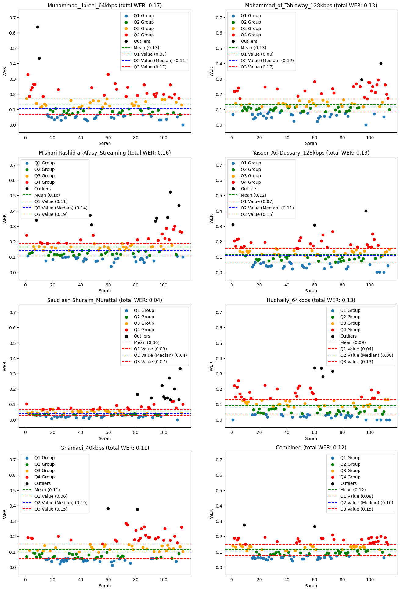

# Experiment 7: Timestamped whisper

Author: Omar Tarek

## Objective

- Get a finetuned version of whisper small model trained on a dataset with timestamps in mind.

## Methodology

### 1. Preparing `quran.com` dataset

* [`quran.com`](https://quran.com) is a website that has [12 sheikhs](https://quran.com/reciters) with word-level timestamps (actually there are 13 sheikhs but the last one is a `kids-repeat` version which means it can't be used for training).

* The `quran.com` dataset has audios as whole sorahs.

* To finetune the model it's needed to have `30-second` samples with the corresponding reference text, and to achieve that an algorithm is needed to cut the sorah audio into `30-second` samples.

* To have smooth cuts, the algorithm needs to detect the silence.

    ### The Algorithm

    * All versions depend on the word-level timestamps, this means all output samples are guaraneed to be cut on a word level **assuming that the `quran.com` timestamps are accurate** (**the assumption was incorrect** take a look below at the different cases where that assumption is violated).

    #### Version 1
    * Processes the sorah on **ayah basis**, which means each **sorah is a set of ayat** and **each ayah is a set of parts**, **each part is a valid output sample**. **It was assumed that there is a silence between ayat (the assumption was incorrect)**.

    * Detects if the sheikh repeated a segment from the sorah, this is an indication that there must be a silence before repeating that segment for the second time.

    * If there was mulitple repeats before exceeding the `30-second` window, the algorithm would prefer the last repeat (it tries to **maximize the duration of the output sample**).

    * Otherwise, exceeding the `30-second` window **without meeting any repeats in the ayah** results in **cutting blindly** on the last word before exceeding the `30-second` window.

    #### Version 2
    * Processes the sorah on **ayah basis**, which means each **sorah is a set of ayat** and **each ayah is a set of parts**, **each part is a valid output sample**. **It was assumed that there is a silence between ayat (the assumption was incorrect)**.

    * It uses the same repetition-detection technique, **additionaly** it uses **waqf symbols** in Quran as a **heuristic** that there is a silence after the word that has that waqf symbol.

    * The repetition-detection technique is **higher in priority** than the waqf-symbols technique, here are the priorities of the waqf symbols if there wasn't any repetition in the ayah before exeeding the `30-second` window:

        1. laazim
        2. waqf-awlaa
        3. jaaiz
        4. wasl-awlaa
        5. muaanaqah
    
    * Even it's an improvement, there are still some ayat that exceed the `30-second` window without any repetition **and without any waqf symbol**, so there are **some sample that've been cut blindly**.

    #### Version 3
    * Processes the sorah as a whole, which means **each sorah is a set of parts directly**, **each part is a valid output sample**.

    * It uses the same repetition-detection technique and waqf-symbols technique, additionaly it considers **ras-ayah** as **a potential waqf**, so here are the new priorities that are **considered after not having any repeats before exceeding the `30-second` window**:

        1. ras-ayah
        2. laazim
        3. waqf-awlaa
        4. jaaiz
        5. wasl-awlaa
        6. muaanaqah
    
    * The output of this algorithm is divided into 2 datasets in the `Datasets` section below.

### 2. The training step

* From openai/whisper github repo `Discussions` section:
    * [1](https://github.com/openai/whisper/discussions/1855):
        > Whisper is not explicitly trained for word-level timestamps and the current outputs are produced by an inference-time trick, which does not give perfectly accurate timing, especially when dealing with pauses.

    * [2](https://github.com/openai/whisper/discussions/838):
        > The `<|notimestamps|>` was used 50% of the samples

#### The first attempt (failed):
* Encode the **word level** timestamps in the reference text during the training step, ex:

    `word1 word2` becomes `<|0.00|>word1<|1.20|> <|2.00|>word2<|3.82|>`

* This was a failed attempt as the finetuned model transcribes only the first word (the number of deletions is huge)

* After a lot of investigation of why the model behaves this way, this attempt is now considered a dead-end.

#### The second attempt (succeeded):
* Encode the **segment level** timestamps in the reference text during the training step, ex:
    `word1 word2` becomes `<|0.00|>word1 word2<|3.82|>`

    

    <em>Figure 07A1</em>: training loss</a>

### 3. Results visualization

#### epoch 1

    

    <em>Figure 07A2</em>: epoch WER 1 results visualization.

---

#### epoch 2

    

    <em>Figure 07A3</em>: epoch 2 WER results visualization.

---

#### epoch 3

    

    <em>Figure 07A4</em>: epoch 3 WER results visualization.

---

#### epoch 4

    

    <em>Figure 07A5</em>: epoch 4 WER results visualization.

---

## Notebooks

[1] training notebooks:
* epoch 1: https://www.kaggle.com/code/omartariq612/prefix-new-start-epoch-1
* epoch 2: https://www.kaggle.com/code/omartariq612/prefix-new-start-epoch-2
* epoch 3: https://www.kaggle.com/code/omartariq612/prefix-new-start-epoch-3
* epoch 4: https://www.kaggle.com/code/omartariq612/prefix-new-start-epoch-4

[2] WER results notebooks:
* epoch 1: https://www.kaggle.com/code/omartarek612/epoch-1-wer
* epoch 2: https://www.kaggle.com/code/omartarik612/epoch-2-wer
* epoch 3: https://www.kaggle.com/code/omartariiik/epoch-3-wer
* epoch 4: https://www.kaggle.com/code/omartariq612/epoch-4-wer

[3] analysis-and-visualization notebook: https://www.kaggle.com/code/omartariq612/analysis-and-visualization

## Datasets

[1] quran.com audio files: https://www.kaggle.com/datasets/abdo3id/quran-com-audio-files

[2] quran.com timestamps: https://www.kaggle.com/datasets/abdo3id/quran-com-site-timestamps

[3] the-algorithm-v3-dataset-part-1: https://www.kaggle.com/code/omartariq612/the-algorithm-dataset-1

[4] the-algorithm-v3-dataset-part-2: https://www.kaggle.com/code/omartariq612/the-algorithm-dataset-2

## References

[1] How to obtain word-level segmentation timestamps?: https://github.com/openai/whisper/discussions/1855

[2] Questions regarding fine-tuning a Whisper model with timestamps: https://github.com/openai/whisper/discussions/838

[3] whisper-quran-cli: https://github.com/OmarTariq612/whisper-quran-cli/tree/new-era
