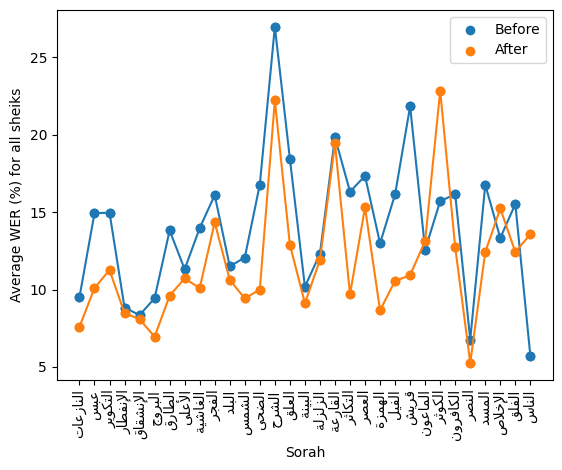

# Experiment 8: To Oversample or Not To Oversample

Auther: Omar Tarek

## Objective

- Discover the effects of the following training strategies on the WER of  `the hard examples` (sorahs that has a relatively high WER compared to others):
    * Train **exclusively** on the hard examples.
    * **Prioritize** the hard examples.
    * **Oversample** the hard examples.
    * **Oversample** and **Prioritize** the hard examples.
    * **Augment** only the hard examples.
    * Use **a smaller batch size**.

---

## Methodology

* All of the following training strategies are applied begining of [**this checkpoint** [1]](https://www.kaggle.com/code/omartariq612/prefix-new-start-epoch-4).

* Hard example is what is either an outlier relative to other examples of a sheikh or a sorah that has WER in the fourth quartile (Q4).

* Outlier is any sorah that has a WER greater than the upper bound of **an accetable range** that is calculated using this formula:

        IQR = Q3 - Q1
        Accebtable range = [Q1 - 1.5 * IQR, Q3 + 1.5 * IQR]


    (any sorah that has WER above Q3 + 1.5 * IQR)

* Only sorahs **from 77 to 114** have been considered (not all hard examples). So whenever hard examples are mentioned in this document it means hard examples **from 77 to 114 only**.

* Here is [the notebook](https://colab.research.google.com/drive/1552xrPwDXR2n2V_36MhTNph1foPHlGyA?usp=sharing) used for identifying hard examples **from 77 to 114**.

### 1. Training exclusively on the hard examples

* The training dataset is construced **exclusively** of the hard examples.

* Shuffling the training dataset is **enabled**.

### 2. Prioritize the hard examples

* The training dataset begins with the hard examples then the rest of the dataset.

* Shuffling the training is **disabled**.

### 3. Oversample the hard examples.

* Hard examples are added **5 times** to the training dataset.

* Shuffling the training dataset is **enabled**.

### 4. Oversample and Prioritize the hard examples.

* This is a combination of the previous 2 training strategies.

* The training set begins with the hard examples but they are added **5 times**.

* Shuffling the training dataset is **disabled**.

### 5. Augment only the hard examples.

* Augment only the hard examples using the following **4 waveform tranformations**:

    ```python
    from audiomentations import TanhDistortion, ClippingDistortion, PitchShift, AddGaussianNoise

    transformations = [
        TanhDistortion(
            min_distortion=0.4,
            max_distortion=0.4,
            p=1.0
        ),
        ClippingDistortion(
            min_percentile_threshold=30,
            max_percentile_threshold=30,
            p=1.0
        ),
        PitchShift(
            min_semitones = -2,
            max_semitones = 3,
            p=1.0
        ),
        AddGaussianNoise(
            min_amplitude=0.003,
            max_amplitude=0.003,
            p=1.0
        ),
    ]
    ```

* Each tranformation is applied separately on all hard examples, therefore there are **4 samples** for each hard example (one per each transformation) in addition to the normal sample (one without applying any transformation).

* Shuffling the training dataset is **enabled**.

* All of those tranformations are **deterministic** except **PitchShift** (it has a range of values **[-2, 3]**).

* Augmentation is done using [audiomentations library [2]]("https://github.com/iver56/audiomentations).


### 6. Use a smaller batch size.

* According to [The tuning_playbook [3]](https://github.com/google-research/tuning_playbook?tab=readme-ov-file#why-shouldnt-the-batch-size-be-tuned-to-directly-improve-validation-set-performance):

    > - Changing the batch size *without changing any other details of the training pipeline* will often affect the validation set performance.

    > - However, the difference in validation set performance between two batch sizes typically goes away if the training pipeline is optimized independently for each batch size.

    > - The hyperparameters that interact most strongly with the batch size, and therefore are most important to tune separately for each batch size, are the optimizer hyperparameters (e.g. learning rate, momentum) and the regularization hyperparameters.

    > - Smaller batch sizes introduce more noise into the training algorithm due to sample variance, and this noise can have a regularizing effect. Thus, larger batch sizes can be more prone to overfitting and may require stronger regularization and/or additional regularization techniques.

* Changing the batch size **does affect the performance of the validation set**, although focusing on other training parameters can be beneficial, it's worth trying to use **a smaller** batch size.

* Considering the batch size of **4 instead of 8**.

* Shuffling the training dataset is **enabled**.

---

## Visualizations and Conclusions

* Each visulaization has **2 columns** of subplots. **The left column** represents the visualization of **the normal training strategy (epoch 5)** and **the right one** represents the visualization of **the specified training strategy**.

### 1. Training exclusively on the hard examples

<p align="center">
    
</p>

<p align="center">
    <span style="color: #888888;"><em>Figure 08A1</em>: Visualization of training exclusively on the hard examples compared to the normal training strategy</span>
</p>

* Training exclusively on the hard examples had negative impact not only on the remaining sorahs but also on the hard examples themselves, therefore it's obvious that this training strategy is not positively effective.

### 2. Prioritize the hard examples

<p align="center">
    
</p>

<p align="center">
    <span style="color: #888888;"><em>Figure 08A2</em>: Visualization of prioritizing the hard examples compared to the normal training strategy</span>
</p>

* Prioritizing the hard examples had negative impact on the targeted hard example WER results, it also affected the rest of the test set WER results but the negative impact wasn't as significant as it was while training exclusively on those examples.

### 3. Oversample the hard examples.


<p align="center">
    
</p>

<p align="center">
    <span style="color: #888888;"><em>Figure 08A3</em>: Visualization of oversampling the hard examples compared to the normal training strategy</span>
</p>

* Oversampling hard examples reduced the WER of those examples without affecting the overall WER results.

* Here is [a notebook](https://colab.research.google.com/drive/1JtKyiKnXlysP5bKaX8cgkl756ZXfcNmw?usp=sharing) that represnts the WER raw data.

### 4. Oversample and Prioritize the hard examples.


<p align="center">
    
</p>

<p align="center">
    <span style="color: #888888;"><em>Figure 08A4</em>: Visualization of oversampling and prioritizing the hard examples compared to the normal training strategy</span>
</p>

* **Adding prioritization** to the oversampling technique **made things worse**, by raising the WER of the overall test set and **vanishing the improvements** of WER of those hard examples that were achieved when using the oversampling technique **solely**.

* **This might be an indication that shuffling has a great impact on the performance** (more expirements need to be conducted to deal with this as a fact).

### 5. Augment only the hard examples.

<p align="center">
    
</p>

<p align="center">
    <span style="color: #888888;"><em>Figure 08A5</em>: Visualization of augmenting the hard examples compared to the normal training strategy</span>
</p>

* There are mixed results. Reduction of the WER of hard examples were achieved in ex: `Muhammad_Jibreel_64kbps`, `Mohammad_al_Tablaway_128kbps` and `Saud ash-Shuraim_Murattal` results while there is a raise of the WER of hard examples in `Yasser_Ad-Dussary_128kbps` and `Ghamadi_40kbps` results.

* There was a huge negative impact on the overall WER for some sheikhs of the test set.
(ex: `Mishari Rashid al-Afasy_Streaming` and `Saud ash-Shuraim_Murattal`).
While there was a limited to no negative impact on the overall WER for some other sheikhs.
(ex: `Mohammad_al_Tablaway_128kbps` and `Hudhaify_64kbps`).

### 6. Use a smaller batch size.

<p align="center">
    
</p>

<p align="center">
    <span style="color: #888888;"><em>Figure 08A6</em>: Visualization of using smaller batch size (batch size is 4) compared to the normal strategy (batch size is 8)</span>
</p>

* Using a smaller batch size (**4 instead of 8**) reduced the WER of the hard examples for `Saud ash-Shuraim_Murattal` but **this is not a pattern**, therefore this technique is **not effective**.

---

## Notebooks

* training notebooks:

    - original-batch-8: https://www.kaggle.com/code/omartariq612/prefix-new-start-epoch-5

    - exclusive-batch-8: https://www.kaggle.com/code/omartarik612/exclusive-prefix-new-start-epoch-5

    - prioritize-batch-8 : https://www.kaggle.com/code/omartariiik/prioritize-prefix-new-start-epoch-5

    - oversample-batch-8: https://www.kaggle.com/code/omartariiik/oversample-prefix-new-start-epoch-5

    - oversample-prioritize-batch-8: https://www.kaggle.com/code/omartariq612/oversample-prioritize-prefix-new-start-epoch-5

    - augment-batch-8: https://www.kaggle.com/code/omartarek612/augment-epoch-5-wer

    - original-batch-4: https://www.kaggle.com/code/omartariiik/smaller-batch-new-start-epoch-5


* WER metric notebooks:

    - original-batch-8 wer: https://www.kaggle.com/code/omartariq612/epoch-5-wer

    - exclusive-batch-8 wer: https://www.kaggle.com/code/omartarik612/exclusive-epoch-5-wer

    - prioritize-batch-8 wer: https://www.kaggle.com/code/omartarik612/prioritize-epoch-5-wer

    - oversample-batch-8 wer: https://www.kaggle.com/code/omartariiik/oversample-epoch-5-wer

    - oversample-prioritize-batch-8 wer: https://www.kaggle.com/code/omartarik612/oversample-prioritize-epoch-5-wer

    - augment-batch-8 wer: https://www.kaggle.com/code/omartarek612/augment-epoch-5-wer

    - original-batch-4 wer: https://www.kaggle.com/code/omartariiik/smaller-batch-epoch-5-wer


* Visualiztion notebook: https://www.kaggle.com/code/omartariq612/exp8-analysis-and-visualization

---

## References

[1] epoch-4 checkpoint: https://www.kaggle.com/code/omartariq612/prefix-new-start-epoch-4

[2] audiomentations: https://github.com/iver56/audiomentations

[3] tuning_playbook: https://github.com/google-research/tuning_playbook?tab=readme-ov-file#why-shouldnt-the-batch-size-be-tuned-to-directly-improve-validation-set-performance
