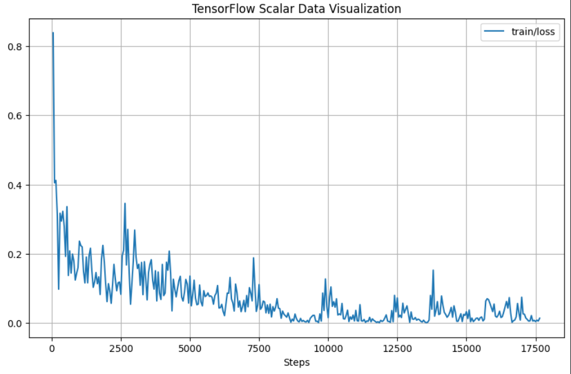

# Experiment 2A: Fine-tuning `Whisper small`

_Sat Nov 11 12:13:27 PM EET 2023_

Author: Omar Tarek

Signed-off: Abdulrhmn Ghanem

## Objective

The objective of this experiment is to achieve approximately the same WER of the whsiper `medium` model (769 M parameters) using a finetuned version of the `small` model (244 M parameters) for Quran recitation.

---


## Experiment setup

  * Accelerator used for the experiment: GPU P100.

  * Training was done on all ayat of the holy Quran that have a duration of 30 seconds or less [[1](https://github.com/openai/whisper/discussions/1118)].

  * The sampling rate of the training is 16kHz (resampling was done on the dataset).

  * Training was done on:
    - Abdul_Basit_Murattal_192kbps
    - Hudhaify_64kbps
    - Husary_128kbps
    - Mohammad_al_Tablaway_128kbps
    - Muhammad_Jibreel_64kbps
    - Ghamadi_40kbps

  * Validation was done on:
    - Minshawy_Murattal_128kbps
    - Yasser_Ad-Dussary_128kbps

---


## Methodology

### Approach
  * Use the training-notebook below to finetune the small model.
 
  * the generated checkpoints are loadable using pytorch-lightning.

  * to make the generated checkpoints loadable by `openai-whisper` official package [[2](https://github.com/openai/whisper/blob/fcfeaf1b61994c071bba62da47d7846933576ac9/whisper/__init__.py#L149C17-L149C17)] load the checkpoint using torch then insert the dimentions (`dims`) of the small model in the state_dict and strip the prefix `model.` from state_dict keys, then save this dict to a file as shown below:

    ```python
    import torch
    from collections import OrderedDict


    state_dict = torch.load("checkpoint.ckpt")
    new_state_dict = {}
    new_state_dict["model_state_dict"] = OrderedDict() 
    new_state_dict["dims"] = {"n_mels": 80, "n_audio_ctx": 1500, "n_audio_state": 768,
                                "n_audio_head": 12, "n_audio_layer": 12, "n_vocab": 51865,
                                "n_text_ctx": 448, "n_text_state": 768, "n_text_head": 12, "n_text_layer": 12}

    for key, value in state_dict["state_dict"].items():
        if key.startswith("model."):
            key = key[6:]
        new_state_dict["model_state_dict"][key] = value

    torch.save(new_state_dict, "loadable_checkpoint.ckpt") 
    ```
  * now it's possible to load that file from `openai-whisper` directly.

    ```python
    import whisper

    model = whisper.load_model("loadable_checkpoint.ckpt")
    ```


### Training Parameters

    learning_rate: 0.0005
    weight_decay:  0.01
    adam_epsilon: 1e-8
    warmup_steps: 2
    batch_size: 16
    num_worker: 4
    num_train_epochs: 1 (10 in total)
    gradient_accumulation_steps: 1
    sample_rate: 16000

---


## Results

  * Results duing training (Minshawy_Murattal_128kbps (ayah duration < 30 secs)):

    |               |  (WER %)  | Validation Loss |
    |---------------|--------------------------------------------------------------|-----------------|
    | vanilla-small | 36.87                                                       |   ------        |
    | epoch-0       | 19.50                                                       | 0.2420          |
    | epoch-1       | 18.26                                                       | 0.2235          |
    | epoch-2       | 15.52                                                       | 0.2122          |
    | epoch-3       | 9.80                                                        | 0.1647          |
    | epoch-4       | 10.84                                                       | 0.1454          |
    | epoch-5       | 6.90                                                        | 0.1232          |
    | epoch-6       | 10.13                                                       | 0.1483          |
    | epoch-7       | 8.34                                                        | 0.1313          |
    | epoch-8       | 5.77                                                        | 0.1045          |
    | epoch-9       | 5.77                                                        | 0.1048          |

  * Training Loss:

    

  ---


  * Results after training, (now we aren't limited to use the low level api of whipser since we can load a checkpoint and use chunking to transcribe longer audio files):

    |               | Minshawy_Murattal_128kbps (no limitation) (WER %) | Yasser_Ad-Dussary_128kbps (no limitation) (WER %) |
    |---------------|---------------------------------------------------|---------------------------------------------------|
    | vanilla-small | 36.33%                                            | 25.87%                                            |
    | epoch-5       | 16.10%                                            | 13.18%                                            |

---

## Issues

  * I faced issues loading some audio files when using `soundfile` as the backend for `torchaudio`, currently using `sox_io` instead as the backend was a quick fix.

  * I could not use pytorch-lightning with (GPU T4 x 2) for training because of this error:

    RuntimeError: Lightning can't create new processes if CUDA is already initialized. Did you manually call torch.cuda.* functions, have moved the model to the device, or allocated memory on the GPU any other way? Please remove any such calls, or change the selected strategy. You will have to restart the Python kernel.

    (changing the GPU to P100 was enough to not face this issue again).

---


## Datasets

  * audio + reference text: https://www.kaggle.com/datasets/omartariq612/quran-reciters

---


## Checkpoints

  * loadable by pytorch-lightning: https://www.kaggle.com/datasets/omartariq612/whisper-small-epochs

  * laodable by openai-whisper: https://www.kaggle.com/datasets/omartarek612/loadable-whisper-checkpoints

---

## Source code

  * training-notebook: https://www.kaggle.com/omartariq612/expirement-2

  * make checkpoints loadable by `openai-whisper` package: https://www.kaggle.com/code/omartarek612/to-loadable-whisper-model

  * validation-notebook: https://www.kaggle.com/code/omartarek612/validation-using-checkpoint

  * validation-cli: https://github.com/OmarTariq612/whisper-quran-cli

---


## References

[1] Reasons for 30s audio length: https://github.com/openai/whisper/discussions/1118

[2] openai-whisper `load_model` function: https://github.com/openai/whisper/blob/fcfeaf1b61994c071bba62da47d7846933576ac9/whisper/\_\_init__.py#L149C17-L149C17